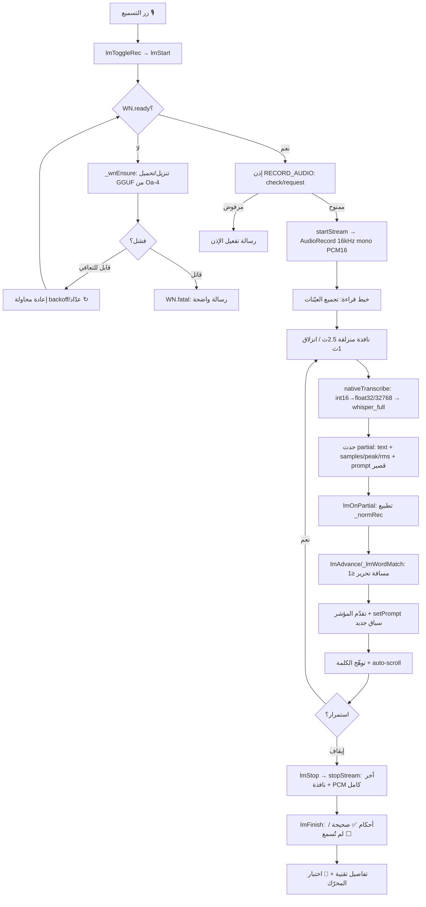

# نظام التسميع (المصحف الحي) — التقرير المرجعي الكامل

مستند مرجعي واحد لطريقة عمل نظام التسميع في تطبيق نور من البداية للنهاية،
مرتّباً بالترتيب الزمني الفعلي لتجربة المستخدم.

---

## ١) نظرة عامة

**ما هو:** نظام «تسميع الحفظ» يعرض صفحة مصحف حقيقية بخطّها المطبعي، ويستمع
لتلاوة المستخدم لحظياً، فيتوهّج كلّ كلمة صحيحة بمجرّد نطقها ويتقدّم المؤشر
تلقائياً — بلا أزرار بين الكلمات، كتجربة «ترتيل».

**الفلسفة (معمارية ترتيل): ثلاث ركائز أصلية**
1. **صوت أصلي** — الالتقاط عبر `AudioRecord` مباشرة على المعالج (PCM خام
   16kHz)، لا يمرّ عبر WebView ولا ضغط ولا إعادة تشكيل في JavaScript.
2. **محرّك أصلي** — استدلال `whisper.cpp` مُجمَّع أصلياً (NDK/JNI) على نموذج
   قرآني مخصّص بصيغة GGUF؛ لا WASM في مسار المستخدم.
3. **مصحف احترافي** — خطوط KFGQPC/QCF لكل صفحة (604 صفحة)، كل كلمة رمز
   طباعي مطابق للمصحف المطبوع، مع تخطيط صفحات دقيق.

**المكوّنات الرئيسية (جملة لكلٍّ):**
- **`WhisperNativePlugin`** (Java) — يفتح المايك، يجمّع النوافذ، ويستدعي المحرّك.
- **`whisper_jni.c`** (C) — جسر JNI فوق whisper.cpp (تحميل/تفريغ/تحرير).
- **محرّك JS `WN`** — تنزيل/تحميل GGUF، الجاهزية، إعادة المحاولة.
- **وحدة JS `LM`** — عرض المصحف، المحاذاة الحيّة، الواجهة، التشخيص.
- **`pages.json`** — تخطيط 604 صفحة (أي آية على أي صفحة + رموزها).
- **خطوط `QCF_P###.woff2`** — خط لكل صفحة، كل كلمة ligature واحد.

---

## ٢) المسار من الضغط حتى النتيجة (خطوة بخطوة)

### أ) فتح شاشة التسميع
**ما يحدث:** عند `go('memorize')` تُستدعى `initMemorize()` التي: (١) تكتب
بصمة البناء، (٢) تبدأ تحميل المحرّك `_wnEnsure()`، (٣) تحمّل تخطيط الصفحات
`lmLoadPages()` ثم تملأ منتقي السور (١–١١٤) وتعرض الصفحة الأولى `lmRender()`.

- `lmLoadPages` يجلب `mushaf/pages.json` (`fetch→json`) مع `try/catch` ورسالة
  ودّية عند تعذّر الجلب أوّل مرة.
- `lmRender` لكل آية في الصفحة: يحقن خط الصفحة `lmInjectFont(p)` (`@font-face`
  ديناميكي `QCF_P###` من `mushaf/fonts/QCF_P###.woff2`)، ويبني مقاطع
  `<span class="qw" id="lmg#">` لكل رمز طباعي، ويأخذ نصّ الكلمات من
  `QURAN_EMBED.surahs[s][a-1]`، ويربط كل كلمة نصية بمقطع الرمز الممثِّل لها
  تناسبياً (حين يختلف عدد الرموز عن عدد الكلمات). يُبنى نموذج المحاذاة `LM.words[]`.

| العنصر | المسؤول |
|---|---|
| التهيئة | `initMemorize()` — index.html |
| تخطيط الصفحة | `lmLoadPages()` → `mushaf/pages.json` |
| حقن الخط | `lmInjectFont()` → `mushaf/fonts/QCF_P###.woff2` |
| بناء العرض + نموذج المحاذاة | `lmRender()`, `QURAN_EMBED` |

*(المصدر الأصلي `mushaf.txt` استُعمل مرّة واحدة وقت التطوير لتوليد `pages.json`؛
التطبيق وقت التشغيل يقرأ `pages.json` فقط.)*

### ب) تحميل المحرّك (GGUF)
**ما يحدث:** `_wnEnsure(force)` مرّة واحدة: يفحص `isAvailable` (المكتبة مبنية؟)،
ثم يبحث عن ملف الموديل المحفوظ؛ إن وُجد >10MB يُحمّله، وإلا ينزّله.

- **المصدر:** `WN_GGUF_URL = huggingface.co/Oa-4/whisper-tiny-ar-quran-gguf/…/ggml-tiny-ar-quran-q8_0.bin` (~43MB، تكميم q8_0).
- **التنزيل:** `_wnDownload` عبر `fetch` يكشف رمز HTTP والحجم؛ يرفض أي حجم
  <10MB (صفحة خطأ) ولا يحفظه.
- **الحفظ:** `Filesystem.writeFile` في مجلد `DATA` (base64).
- **التحميل:** `WhisperNative.loadModel({path})` → `nativeInit` →
  `whisper_init_from_file_with_params`. عند النجاح `WN.ready=true` وتُسحب
  معلومات النموذج عبر `modelInfo()` (تشخيص).
- **إعادة المحاولة (تعافٍ):** الفشل القابل للتعافي (شبكة/تنزيل/تحميل) لا يُقفل
  المحرّك — يُعاد عند فتح التسميع/ضغط التسجيل، بعدّاد محاولات (`WN_MAX_ATTEMPTS=5`)
  ومهلة بين المحاولات (`WN_BACKOFF_MS=4000`). فشل تحميل الموديل يحذف الملف
  ليعيد التنزيل. الاستنفاد → زر «↻ إعادة المحاولة» (`_wnRetry`). الفشل القاتل
  فقط (بيئة غير أصلية/المكتبة غير مبنية) يُقفل عبر `WN.fatal` برسالة صريحة.

| العنصر | المسؤول |
|---|---|
| التهيئة والتعافي | `_wnEnsure`, `_wnFail(msg,fatal)`, `_wnRetry` |
| التنزيل | `_wnDownload` → `WN_GGUF_URL` (Oa-4) |
| الحفظ/التحميل | `Filesystem.writeFile`, `WhisperNative.loadModel`, `nativeInit` |

### ج) الأذونات (RECORD_AUDIO)
**ما يحدث:** قبل فتح المايك يُطلب إذن التسجيل من طبقتين:
- **JS:** `lmStart` يستدعي `P.checkPermissions()` ثم `P.requestPermissions()` إن
  لم يُمنح، قبل `startStream`.
- **أصلي (خط دفاع ثانٍ):** `startListening` في الـplugin يفحص
  `getPermissionState("microphone")`؛ إن لم يُمنح → `requestPermissionForAlias`،
  ويعالج القرار في `micPermCallback` (يُكمل عند المنح، أو يرفض برسالة «إذن
  مرفوض — فعّله من الإعدادات» عند الرفض).
- الإعلان: `@Permission(RECORD_AUDIO, alias="microphone")` + `AndroidManifest.xml`.

### د) بدء التسجيل
**ما يحدث:** الزر `lmMic` → `lmToggleRec()` → `lmStart()`. إن لم يكن
`WN.ready` يعرض حالة التحميل/إعادة المحاولة ولا يبدأ. عند الجاهزية يصفّر
التلوين، يُفعّل قفل اليقظة، يسجّل مستمع `partial`، ويستدعي:
```
P.startStream({window_sec:2.5, slide_sec:1.0, prompt: سياق قصير حول المؤشر})
```
- **الطبقة الأصلية** `startListening`: ينشئ `AudioRecord` بـ
  `AudioSource.VOICE_RECOGNITION` · `16000Hz` · `CHANNEL_IN_MONO` ·
  `ENCODING_PCM_16BIT` · حجم buffer `max(getMinBufferSize, SR)×2` (≥1ث).
  خيط قراءة `MAX_PRIORITY` يقرأ كتل `2048` عيّنة ويراكمها.

### هـ) البثّ والنوافذ المنزلقة
**ما يحدث:** خيط القراءة يجمّع العيّنات في قائمة داخلية؛ كل `slideSamples`
(~1ث من الصوت الجديد) يُرسل نافذة بطول `winSamples` (~2.5ث):
```
from = max(0, total - winSamples);  to = total;   dispatchWindow(from,to,…)
```
- `dispatchWindow` ينسخ عيّنات النافذة (`short[]`)، يقيس ذروة/RMS (تشخيص)،
  ثم يستدعي `nativeTranscribe` ويُطلق حدث `partial` يحمل:
  `{text, ms, samples, peak, rms, prompt_len, threads, final}`.

| العنصر | المسؤول |
|---|---|
| الالتقاط | `startListening` (AudioRecord) — WhisperNativePlugin.java |
| النوافذ | `dispatchWindow`, `winSamples=2.5×SR`, `slideSamples=SR` |
| القياس | ذروة/RMS للنافذة (إثبات أن الصوت واصل) |

### و) التعرّف (whisper.cpp)
**ما يحدث:** `nativeTranscribe(ctx, pcm, "ar", threads, prompt)` في
`whisper_jni.c`:
- **صيغة الإدخال:** `int16 → float32` بالقسمة على `32768.0f` (مطبَّع [-1,1])
  قبل `whisper_full`.
- **المعاملات:** `WHISPER_SAMPLING_GREEDY` · `language="ar"` · `translate=false`
  · `no_timestamps=true` · `suppress_blank=true` · `n_threads=clamp(1..4)`.
- **الprompt:** **سياق قصير (~12 كلمة) حول المؤشر** يبنيه `_lmPromptAt` ويُحدَّث
  عبر `setPrompt` مع تقدّم المؤشر — لا الصفحة كاملة (كانت تتجاوز حدّ tokens
  وتكتم المخرَج).

### ز) المعالجة والمحاذاة
**ما يحدث:** الحدث `partial` → `lmOnPartial(ev)`:
- يراكم بيانات النافذة في `LM._wins` (تشخيص) ويحفظ آخر نص مسموع `LM._heard`.
- يطبّع كل كلمة مسموعة عبر `_lmNorm` → `_normRec` (يصحّح تحريفات whisper
  الشائعة: الله/الهمزة/الخلط الصوتي).
- `lmAdvance(heard)`: لكل كلمة مسموعة يبحث في نافذة `[cursor, cursor+4)`
  ويطابق عبر `_lmWordMatch` (تطابق تام أو مسافة تحرير `_memED ≤ 1` للكلمات
  ≥4 أحرف). عند التطابق: تُلوَّن ✅ ويتقدّم المؤشر لآخر كلمة مطابَقة (رتيب،
  لا يرجع)؛ المتخطّاة تُعرض ✅ مؤقتاً.
- عند تقدّم المؤشر يُحدَّث prompt المحرّك للسياق الجديد.

### ح) الواجهة الحيّة
- **توهّج الكلمة:** `_lmActivate(i)` يضيف `.qw.active` (`@keyframes qwglow`).
- **auto-scroll:** `el.scrollIntoView({behavior:'smooth', block:'center'})`.
- **إخفاء/إظهار:** `lmToggleHide` يبدّل `.lm-hidden` (يُخفي غير المُلوَّن —
  للاختبار من الحفظ).
- **الأحكام الثلاثية:** ✅ صحيحة (تجاوزها المؤشر) · ⬜ لم تُسمع (لا تُحسب خطأً)
  · توهّج الكلمة الجارية.

### ط) الإيقاف والنتيجة
**ما يحدث:** `lmStop()` → `P.stopStream()` (يعيد آخر نافذة + PCM الكامل)،
يحفظ الصوت لـ«استمع للمسجَّل»، ثم `lmFinish()`:
- يحسب: ✅ ما تجاوزه المؤشر، ⬜ الباقي (لم يُسمع).
- يعرض حكماً: «✓ أتممت الصفحة (٪)» أو «أُكمل ok/N كلمة · miss لم تُسمع».
- يبني لوحة «تفاصيل تقنية» (`_lmDiagHtml`).

---

## ٣) المكوّنات والتقنيات المستخدمة

| المكوّن | التقنية | الملف/الموقع | الدور |
|---|---|---|---|
| WhisperNative | Capacitor Plugin (Java) | `WhisperNativePlugin.java` | فتح المايك، النوافذ، الأذونات، جسر المحرّك |
| جسر الاستدلال | JNI/C فوق whisper.cpp | `whisper_jni.c` | init/transcribe/free + modelInfo/config |
| المحرّك | whisper.cpp v1.7.4 (NDK/CMake) | `cpp/CMakeLists.txt` | استدلال greedy عربي |
| النموذج | GGUF q8_0 (~43MB) | `Oa-4/whisper-tiny-ar-quran-gguf` | تعرّف صوت القرآن |
| الالتقاط | Android AudioRecord | `startListening` | PCM 16kHz mono خام |
| محرّك JS الأصلي | حالة `WN` + `_wn*` | index.html | تنزيل/تحميل/تعافٍ |
| العرض/المحاذاة | حالة `LM` + `lm*` | index.html | مصحف حيّ + محاذاة |
| تخطيط الصفحات | JSON (604 صفحة) | `mushaf/pages.json` | آيات/رموز كل صفحة |
| الخطوط | KFGQPC/QCF woff2 | `mushaf/fonts/QCF_P###.woff2` | رسم طباعي لكل صفحة |
| نصّ الكلمات | مضمَّن | `QURAN_EMBED.surahs` | نموذج المحاذاة |
| التطبيع | `_normRec`/`snorm`, `_memED` | index.html | تصحيح تحريفات + مسافة تحرير |

---

## ٤) المسار الاحتياطي والتشخيص

**WASM:** لا يُستعمل في مسار مستخدم التسميع إطلاقاً. محرّك `transformers.js`
(WASM) و`_w2Init` **كسولان** — يعملان فقط عند: (أ) حزمة الذهب (`_gsRun`،
worker مستقل)، (ب) الفحص الذاتي/التهيئة على الويب. على أندرويد الأصلي: GGUF
فقط.

**أدوات التشخيص (في «تفاصيل تقنية»):**
- **🧪 اختبار المحرّك** (`_lmEngineTest`) — يمرّر صوتاً قرآنياً معروفاً (الفاتحة
  ١:١) مباشرة إلى whisper.cpp/GGUF بنفس المسار؛ يحسم: الموديل سليم (العطل في
  الالتقاط) أم مكسور.
- **مقارنة الوصول** — ذروة buffer التشغيل مقابل ذروة النافذة المُرسَلة (يكشف
  انفصال الـbuffer: صوت يُسجَّل لكن لا يصل المحرّك).
- **تفريغ النوافذ** — لكل نافذة: عيّنات/ذروة/RMS/خيوط/طول prompt/النص الخام (كل
  النوافذ).
- **معلومات النموذج** — `n_vocab/n_audio_ctx/n_text_ctx/n_mels/ftype/multilingual/type`
  من `whisper_init` (يثبت صحّة GGUF).
- **معاملات whisper** — `language/translate/single_segment/temperature/…` الفعلية.
- **اختبار بلا prompt** (`_lmTogglePrompt`) — تشغيل خام لعزل تحيّز الprompt.
- **↻ إعادة تحميل المحرّك** (`_wnRetry`) — إعادة محاولة يدوية بعد الاستنفاد.
- **🔊 استمع للمسجَّل** — تشغيل PCM الكامل الملتقَط.

---

## ٥) نقاط الفشل المعروفة والحلول

| المشكلة | السبب | الحل |
|---|---|---|
| الصوت مقطّع/يأكل كلمات | الالتقاط عبر WebView/`MediaRecorder` + إعادة تشكيل JS | التحوّل الكامل لـ`AudioRecord` أصلي (PCM خام 16kHz)، الصوت لا يغادر الطبقة الأصلية |
| whisper يُخرج شظية («نِينَ») | تمرير **الصفحة كاملة** كـ`initial_prompt` (مئات الكلمات) يتجاوز حدّ tokens ويكتم المخرَج | prompt قصير (~12 كلمة) حول المؤشر يُحدَّث عبر `setPrompt` |
| المحرّك يتعلّق بعد فشل واحد | مِزلاج `WN.tried` يمنع كل محاولة لاحقة | تمييز الفشل القاتل عن القابل للتعافي؛ إعادة محاولة بعدّاد+backoff+زر يدوي |
| whisper يسمع شبه صمت | (احتمال) تمرير int16 خام بدل float32 | `whisper_jni.c` يقسم على `32768.0f` (مؤكَّد سليم)؛ أُضيفت مقاييس ذروة/RMS لإثباته |
| تنزيل WASM 227MB بدل GGUF | التهيئة الأولى كانت تستدعي `_w2Init` (WASM) | التهيئة الأصلية تنزّل GGUF (~43MB) عبر WhisperNative؛ WASM كسول لحزمة الذهب فقط |
| «تعذّر بدء الالتقاط» | `AudioRecord` يفشل بصمت بلا إذن RECORD_AUDIO | طلب الإذن runtime من JS + الطبقة الأصلية، ورسائل فشل صريحة |
| ملف موديل تالف يعيد الفشل | إعادة تحميل نفس الملف الفاسد | حذف الملف عند فشل التحميل ليعيد التنزيل نظيفاً |

---

## ٦) مخطّط التدفّق الكامل



مخطّط مبسّط (ASCII):

```
[🎙 زر] → lmStart → WN.ready? ──لا──► _wnEnsure(GGUF/Oa-4,~43MB) ──فشل──► إعادة محاولة(backoff/↻)
                       │نعم
                       ▼
            إذن RECORD_AUDIO → startStream
                       ▼
   AudioRecord(16kHz mono PCM16) ─► نوافذ 2.5ث/انزلاق 1ث
                       ▼
   whisper.cpp(float32, ar, greedy, prompt قصير) ─► نص جزئي/نافذة
                       ▼
   _normRec → lmAdvance/_lmWordMatch(تحرير≤1) → تقدّم المؤشر
                       ▼
   توهّج الكلمة + auto-scroll + إخفاء/إظهار
                       ▼
   lmStop/lmFinish → أحكام ثلاثية (✅ / ⬜) + تشخيص
```

---

*مرجع: بُني نظام التسميع عبر مراحل ٠–٥ (حذف النظام القديم، جلب أصول المصحف،
البثّ الأصلي، المحاذاة الحيّة، الواجهة، التنظيف) ثم إصلاحات (float32/prompt،
التعافي، الأذونات) وأدوات تشخيص ذاتي. انظر أيضاً: `tasmee-system-map.md`،
`tasmee-diagnosis.md`.*
